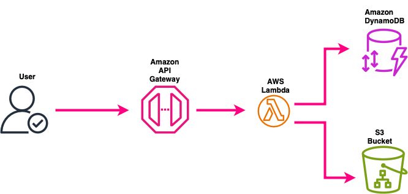

# URL Shortener

A serverless URL shortener built using **AWS Lambda, API Gateway, S3, and Terraform**. This project generates short URLs while keeping infrastructure as code with Terraform.

## Features

- Shorten long URLs using a unique short code
- Serverless architecture using AWS Lambda & API Gateway
- Terraform used for automated infrastructure deployment
- Secure and scalable, following AWS best practices



## Prerequisites

Before deploying, ensure you have:

- **AWS CLI** configured
- **Terraform** installed
- **Python 3.x** installed

### AWS CLI Configure

```bash
aws configure
```

### Terraform

```bash
brew tap hashicorp/tap
brew install hashicorp/tap/terraform
```

### Python Install

```bash
brew install python
```

## Setup & Deployment

### 1. Clone the Repository

```sh
git clone https://github.com/Alseals1/URLShortener.git
cd URLShortener
```

### 2. Create a .env File

```sh
TABLE_NAME=shortened-urls
REGION=YOUR_AWS_Region
```

### 3. Configuring Terraform Variables

Create a terraform.tfvars file in the project’s root directory.(Do Not Commit This File)

```sh
aws_region          = "your-aws-region"
s3_bucket_name      = "your-s3-bucket-name"
dynamodb_table_name = "your-dynamodb-table-name"
lambda_function_name = "your-lambda-function-name"
```

Ensure that terraform.tfvars is listed in .gitignore to avoid committing sensitive data.

### 4. Package & Upload Lambda Function

```sh
zip lambda.zip lambda_function.py
```

### 5. Deploy Infrastructure with Terraform

```sh
terraform init
terraform plan
terraform apply
```

### 6. Test API Endpoint

```sh
curl -X POST https://your-api-id.execute-api.us-east-1.amazonaws.com/shorten \
     -H "Content-Type: application/json" \
     -d '{"long_url": "https://example.com"}'
```
